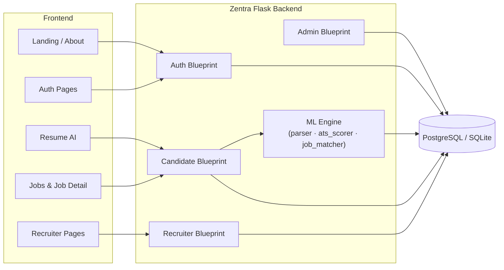
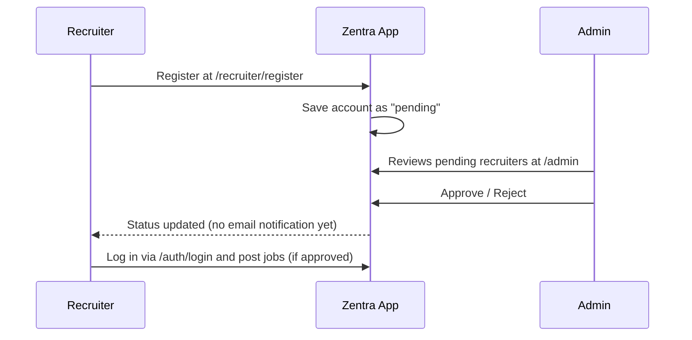
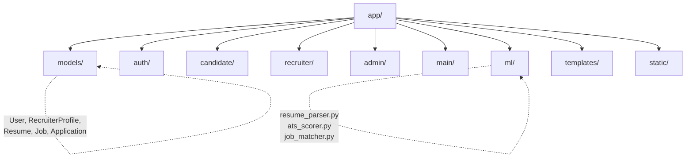

# 🧭 Zentra

**AI-powered Resume ATS Checker + Job Seeking Platform**

Zentra is a Flask + PostgreSQL backend that powers a full job-search ecosystem — candidates can score their resumes against real ATS logic, build resumes, and apply to jobs; recruiters can post roles and manage applicants; admins keep the gate on who gets to recruit.

🔗 **Live demo:** [zentraats.vercel.app](https://zentraats.vercel.app)

---

## 📌 Table of Contents

- [Overview](#-overview)
- [Tech Stack](#-tech-stack)
- [User Roles](#-user-roles)
- [Architecture](#-architecture)
- [Folder Structure](#-folder-structure)
- [Getting Started](#-getting-started)
- [Troubleshooting](#-troubleshooting)
- [Roadmap](#-roadmap--notes)

---

## 🔍 Overview

Zentra sits behind a set of frontend pages (landing, auth, about, recruiters, resume-ai, jobs, job-detail) and handles everything server-side: auth, resume parsing, ATS scoring, job matching, and recruiter approvals.



---

## 🛠 Tech Stack

| Layer | Technology |
|---|---|
| **Backend Framework** | Python 3.11+, Flask 3 |
| **Database** | PostgreSQL via SQLAlchemy (auto-falls back to local SQLite if `DATABASE_URL` isn't set) |
| **Auth** | Flask-Login (sessions), Flask-WTF (forms + CSRF) |
| **ATS Scoring** | scikit-learn — TF-IDF + cosine similarity |
| **Resume Parsing** | pypdf, python-docx |
| **Other Backend Libs** | Flask-Migrate, Flask-Limiter, Flask-Mail, Authlib (Google OAuth), reportlab, gunicorn |
| **Frontend** | Jinja templates styled with Tailwind CDN + Bootstrap Icons |

---

## 👥 User Roles

Zentra has three roles sharing **one login page** — there's no separate "recruiter login."

| Role | How they get in | What they can do |
|---|---|---|
| 🧑‍💼 **Candidate** | Signs up directly | Check ATS score, build a resume, apply to jobs |
| 🏢 **Recruiter** | Registers at `/recruiter/register` with company details | Stays `pending` until admin-approved → then can post jobs |
| 🛡️ **Admin** | Seeded account | Approves/rejects recruiter registrations at `/admin` |



---

## 🏗 Architecture

The `app/` package is organized by **blueprint** (feature area), plus a dedicated `ml/` module for the resume + matching logic:



- **`models/`** — `User`, `RecruiterProfile`, `Resume`, `Job`, `Application`
- **`auth/`** — login, candidate signup, logout
- **`candidate/`** — dashboard, ATS checker, resume builder, apply-to-job
- **`recruiter/`** — company registration, dashboard, post job, view applicants
- **`admin/`** — recruiter approval queue
- **`main/`** — public pages: landing, about, jobs list, job detail
- **`ml/`** — `resume_parser.py`, `ats_scorer.py`, `job_matcher.py`

---

## 📂 Folder Structure

```
Zentra/
├── app/
│   ├── models/        # User, RecruiterProfile, Resume, Job, Application
│   ├── auth/           # login, candidate signup, logout
│   ├── candidate/      # dashboard, ATS checker, resume builder, apply
│   ├── recruiter/      # company registration, dashboard, post job
│   ├── admin/          # recruiter approval queue
│   ├── main/           # public pages: landing, about, jobs, job detail
│   ├── ml/             # resume_parser.py, ats_scorer.py, job_matcher.py
│   ├── templates/      # Jinja templates (base.html + per-blueprint)
│   └── static/         # css / js / img + resume uploads
├── migrations/         # DB migrations
├── tests/              # test suite
├── .snapshots/
├── run.py              # dev server entry point
├── seed.py             # creates tables + default admin
├── seed_microsoft.py
├── seed_rich.py
├── sync_schema.py      # patches schema without dropping data
├── requirements.txt
├── pyproject.toml
├── runtime.txt
├── vercel.json
└── .env.example
```

---

## 🚀 Getting Started

### 1. Clone & set up a virtual environment

```bash
git clone https://github.com/varunshetty1893/Zentra.git
cd Zentra

python -m venv venv
source venv/bin/activate        # Windows: venv\Scripts\activate
```

### 2. Install dependencies

```bash
pip install -r requirements.txt
```

### 3. Configure environment variables

```bash
cp .env.example .env
```

Edit `.env` and set:
- `SECRET_KEY`
- `DATABASE_URL` (Postgres) — or leave unset to use local SQLite for dev

### 4. Seed the database & run

```bash
python seed.py       # creates tables + a default admin account
python run.py         # → http://127.0.0.1:5000
```

**Default admin login** (change the password after first login):

```
admin@zentra.example.com / Admin@123
```

---

## 🩹 Troubleshooting

<details>
<summary><strong>Seeing <code>column X does not exist</code>?</strong></summary>

<br>

This happens when the models change (new fields added) after you've already created your database tables. Instead of dropping everything, run:

```bash
python sync_schema.py
```

It adds any missing columns/tables **without touching existing data** — safe to re-run any time.

</details>

---

## 🗺 Roadmap / Notes

- [ ] `seed.py` currently uses `db.create_all()` for a quick start — switch to **Flask-Migrate** for real migrations:
  ```bash
  flask db init && flask db migrate && flask db upgrade
  ```
- [ ] ATS scoring is TF-IDF + cosine similarity — solid for an MVP demo, not production-grade NLP. Swap out `app/ml/ats_scorer.py` for a stronger model when ready.
- [ ] File uploads currently save to `app/static/uploads` — move to S3 / Cloud Storage before deploying anywhere with an ephemeral filesystem.
- [ ] No email sending wired up yet (e.g. "you're approved" notifications) — admin approvals just flip a DB flag for now.

---

<p align="center">Made with Flask, scikit-learn, and a healthy dislike of broken resumes.</p>
